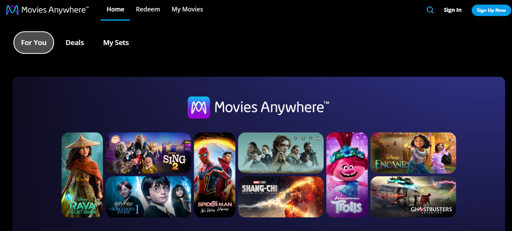
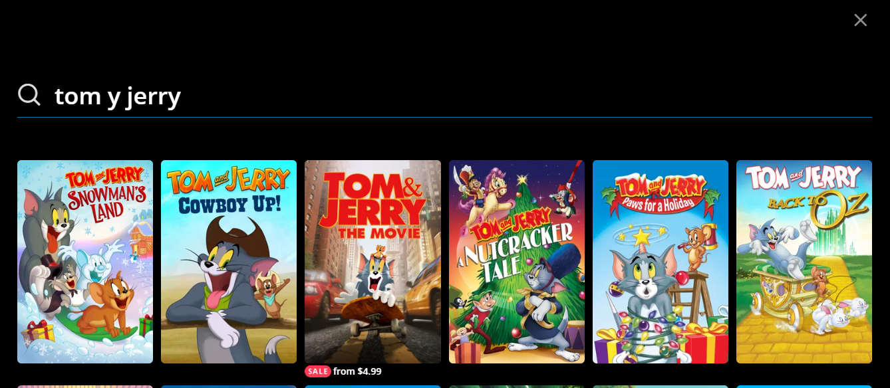
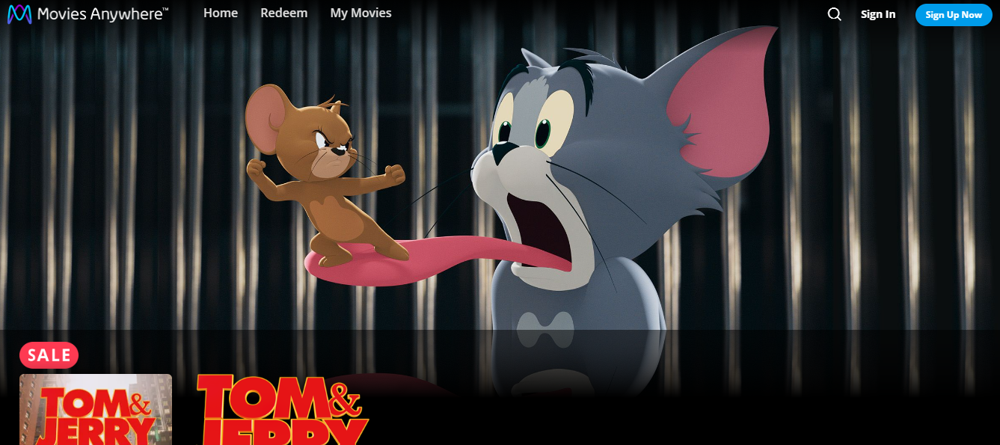
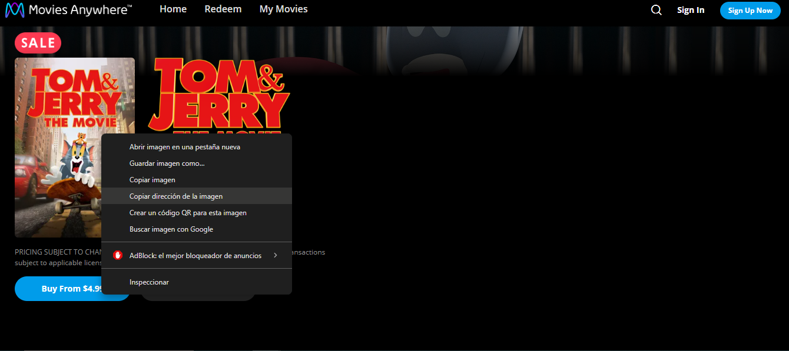

## Getting Started

First, run the development server:

```bash
npm run dev
# or
yarn dev
# or
pnpm dev
# or
bun dev
```

Open [http://localhost:3000](http://localhost:3000) with your browser to see the result.

# NOTA:

## Página autorizada para extraer las imágenes de portada:

https://moviesanywhere.com/home

Pasos para incluir el link de la imágen de internet:

1. Visitar el link y dar click en el ícono de la lupa para buscar:
   

2. Escribir en la barra de búsqueda la película que se desea visualizar
   

3. Dar click sobre la película que se desea ver
   

4. dar click sobre la imágen pequeña de la portada, y seleccionar la opción Copiar dirección de la imágen
   

5. ¡ Y listo! al agregar o editar una película este es el enlace que debes pegar en el campo de "Portada"
